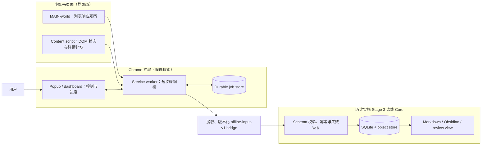

# 浏览器扩展采集探索

> 状态：**探索**，2026-08-17。本文由固定 revision 的候选项目静态研究推导，不是当前产品架构，不表示历史实施 Stage 4 已经完成，也不表示真实网站兼容性已经验证。平台写操作只是远期研究对象。

## 结论

未来如果把现有油猴脚本升级为 Chrome 扩展，推荐采用“**列表响应发现为主、DOM 点击详情补缺为辅、离线 Core 独占规范状态**”的结构，而不是让扩展逐篇打开全部帖子或建立第二套长期知识库。

- 现有 userscript/MAIN-world bridge 继续负责高效发现点赞和收藏列表，输出稳定 `note_id`、来源关系和短期访问材料。
- content script 只负责页面状态识别、滚动推进和少量详情 fallback。
- service worker 只编排可中断的短步骤；任务进度必须写入 durable store，不能依赖内存变量或一次长 `sendMessage`。
- 扩展只向 Core 交付脱敏、版本化 observation；SQLite、对象存储、媒体 receipt 和知识库投影继续由历史实施 Stage 3 Core 管理。
- 取消收藏、点赞或其他平台写操作必须是独立、默认禁用的 capability，不能混进读取扩展。

研究依据：[`xhs_web_crawler` 专项审查](../../research/projects/xhs-web-crawler/review.md)、[RedCaChe 专项审查](../../research/projects/redcache/review.md)和[研究总表](../../research/catalog.md)。

## 推荐架构



图中的扩展 job store 只保存浏览器任务恢复所需的最小状态；它不替代 Core 的 canonical state。Cookie、完整 token URL、HAR、profile 和页面正文不得作为普通扩展日志或长期配置保存。

## 数据获取顺序

| 优先级 | 路径 | 用途 | 完成条件 |
|---|---|---|---|
| 1 | 列表响应观察 | 批量发现 `liked`/`saved` 关系、稳定 ID 和列表字段 | 服务端 cursor/end marker，或明确标为 partial 的边界证据 |
| 2 | DOM 滚动 | 推进列表加载、检测登录墙/验证码/Schema drift | 有预算的多信号 idle；固定滚动次数不能证明全量 |
| 3 | 详情点击 fallback | 只补新增、变化或列表字段不足的帖子 | 校验 expected `note_id` 和最终 URL 后提交详情结果 |
| 4 | 人工诊断 artifact | selector/Schema 失效时补最小证据 | 用户显式启用、精确 allowlist、脱敏并设置保留期 |

`xhs_web_crawler` 的点击—等待—关闭—滚动循环可作为第 3 层的行为参考，但它不是 Playwright，也不是收藏/点赞专项实现。默认成功路径仅固定等待就约 3.5 秒/篇，2000 篇接近两小时，不能承担主扫描。

## 任务和 checkpoint

扩展侧至少需要以下任务状态：

```text
queued
discovering
detail_pending
exporting
paused
complete
failed
```

每个 run 应保存：

- `runId`、`accountBinding`、`sourceRelation` 和 adapter/schema 版本；
- 当前页/cursor、扫描边界证据、已确认 observation 摘要；
- 每个 `note_id` 的 `discovered/detail_pending/detail_ok/detail_failed/exported`；
- attempt、类型化错误、停止原因、更新时间和任务预算；
- Core 对每批 observation 的 ack。没有 ack 不推进浏览器侧 checkpoint；
- `complete` 与 `partial` 必须分开。只有证明扫描完整时，才允许对“本轮未见”关系进入疑似移除判断。

MV3 service worker 可能休眠或被终止，因此 popup 不能拥有事实状态，长任务也不能绑定在一次消息调用上。popup/dashboard 应随时从 durable store 重建进度。

## 身份、权限和敏感数据

- manifest 只申请小红书/RedNote 的精确 host 权限；`<all_urls>`、cookies、debugger、webRequest 和 unlimitedStorage 均需逐项证明必要性。
- 每轮开始和恢复后校验 `(hostId, accountId, profileId, sessionRevision)`；身份未知或不匹配立即暂停。
- `note_id` 是稳定实体主键；带 query 的可打开 URL只是短期访问材料，不作为 canonical URL。
- Cookie、token、storage state、HAR、截图和完整页面响应均按 secret/个人数据处理，不进入 Markdown、普通日志或 Git。
- 登录变化、验证码、429、安全限制、Schema drift 或最终 URL 不匹配时，保存 checkpoint 后停止，不自动切换账号、代理或 provider。
- 浏览器任务默认全局串行；写操作如果未来获批，应拥有独占 lease，并在点击前再次核验帖子 ID、URL 和 desired state。

## 本地整理与平台写分离

RedCaChe 的 `unreviewed/keep/remove_from_xhs/evergreen/archived` 人工视图说明“本地整理决策”有独立产品价值，但平台关系和用户决策必须拆开：

| 概念 | 保存位置 | 是否触发平台操作 |
|---|---|---|
| `review_status` | 本地 canonical/derived state | 否 |
| `source_relation` | Core observation/state | 否；只描述已观测关系 |
| `action_intent` | 独立写操作队列 | 否；等待审批 |
| `approved_action` | 独立写 capability | 是；逐项执行并验证 |

未来若研究取消收藏，流程必须是：冻结 exact list 与 digest → 展示 diff → 用户明确授权 → 单项执行 → desired-state 校验 → unknown-outcome 停止/人工对账 → 审计记录。空 ID 不得表示“全部执行”，数据库备份也不能被称为可自动恢复平台收藏。

## 研究对象的采用边界

| 研究对象 | 可借鉴 | 不采用 |
|---|---|---|
| `xhs_web_crawler` | popup/content 分工、点击详情 fallback、滚动循环 | `data-index` 身份、固定等待、全量逐篇点击、未接通的 background/CDP/HAR、源码复制 |
| RedCaChe 纯扩展 | 限域 manifest、content/worker/IndexedDB/dashboard 分层、人工 review UX、canonical/open URL 分离 | 一次性内存全量、32 位 fallback ID、无 checkpoint 的 backfill、latent unfavorite handler |
| RedCaChe 旧服务器 | ImportRun 外形、备份意图、Obsidian projection | 无鉴权任意 URL 导航、共享 page 并发、headless/stealth 写操作、与扩展割裂的数据模型 |
| 历史实施 Stage 3 Core | canonical state、对象库、媒体 receipt、失败恢复、可重建投影 | 浏览器、Cookie、签名和平台网络能力 |

许可证边界不因研究评级改变：`xhs_web_crawler` 的 LICENSE 缺失/额外限制冲突意味着只允许 clean-room 借鉴行为；RedCaChe 根项目为 MIT，但复制源码仍需保留许可声明并核查第三方依赖。

## 推荐实施切片

1. 统一现有点赞/收藏 userscript 的版本化 JSON 输出，并实现 `offline-input-v1` 桥接。
2. 用合成页面实现 MV3 壳层：popup、service worker、durable job store、content script 消息校验和 Core batch ack；不访问真实平台。
3. 用离线数据实现本地 review 视图，验证分类、搜索、保留/归档和 Obsidian projection。
4. 按执行时已确认的采集范围、身份与停止条件，以小样本验证列表发现、详情 fallback 和身份绑定。此切片对应当前产品阶段二，不要求重新走完旧的历史实施 Stage 4 流程；已有授权按其适用范围执行。
5. 平台写操作继续留在独立决策之后，不随读取扩展一起实现。

验收时，扩展重启、service worker 终止、页面导航失败、部分批次已被 Core 接收以及账号不匹配都必须能够确定性恢复或安全停止。
