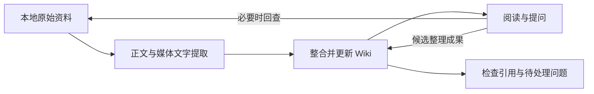

# LLM Wiki：导出适配与知识整理候选试验

状态：**探索（Exploration）**，尚未采纳为产品设计或正式数据协议。
更新日期：2026-09-13。

本文讨论当前产品阶段三。准备包最初使用合成资料建立基线；用户随后说明已有下载的帖子，后续下载的文件结构可能变化。
用户已指定现有 Notion 实验归档，位置为 `.local/notion-stage3/2026-09-12/`，并明确计划用这些帖子探索知识库／LLM Wiki 构建方案。首次导入时部分视频仍在下载；媒体覆盖以对应导入报告的观测时间为准。这不代表已验收完整导出或完成真实 Wiki 整理。

2026-09-17 迁移说明：原始归档已移至项目内可见的 `资料库/原始来源/历史导出/2026-09-12/`，旧位置保留兼容符号链接。Notion 专用读取器的 `--archive` 应使用新物理路径。用户已要求 Notion 与 Galaxy 的正文、元数据和媒体采用统一存储；具体已实现约定见[个人资料库工具](../../prototypes/note-library/README.md)。这一归档整理不代表已采纳或构建某种知识库方案。

当前目标与边界见[产品设计](../design/product-design.md#产品阶段三本地整理与后续操作)，当前优先级见[路线图](../design/roadmap.md)。
配套的[离线准备原型](../../prototypes/llm-wiki-prep/README.md)用于检查候选结构，不代表知识库已经生成或通过实际使用验收。

## 要验证的问题

LLM Wiki 是否能把多篇帖子整理成可持续维护、可追溯的知识页面，并帮助用户再次找到和使用信息？
已准备的工作流、合成例子和引用检查可继续用于接入真实样本；当前文件布局只应影响相应的导入实现。
这些工作不能提前证明归纳质量、检索效果、模型成本或处理 2000 多篇收藏的可行性。

## 按含义找回帖子

用户已确认的搜索目标见[产品设计](../design/product-design.md#按含义搜索帖子)：没有搜索词或近义词的帖子，只要实际意义相关，也应能被找到。下面是实现与验收候选，尚未确定模型、数据协议或结果界面。

语义检索可以比较查询与内容的含义表示，短关键词查找较长帖子属于需要专门评测的查询与文档匹配场景。[Sentence Transformers 语义检索说明](https://www.sbert.net/examples/sentence_transformer/applications/semantic-search/README.html)介绍了这种表示与检索方式；它不保证任意隐含用途都能被准确识别。

拟比较三种关联来源：正文／已提取媒体中的直接语义；有证据支持的概念、用途或情境描述；已有 Wiki 中的主题到原帖关系。概念描述与 Wiki 关系属于派生判断，保留出处、推断性质及处理版本，不能伪装成作者原话或用户标签。原始可读内容始终保留检索入口，避免摘要遗漏变成永久漏检。

候选处理方式：

1. **覆盖实际内容。** 标题、正文、图片文字、视觉内容及视频中的已提取信息分别保留定位与缺口。OCR 只提供识别文字；纯图片的情境可另评估图像描述或图文语义检索。跨图文检索有对应[技术示例](https://www.sbert.net/examples/sentence_transformer/applications/image-search/README.html)，但当前原型尚未处理真实媒体。
2. **从多个入口找候选。** 保留关键词匹配，同时比较原文语义、派生概念与主题关联；必要时将短查询扩展为几种可能的意思。扩展范围要有界，单词歧义不能被静默固定为一个解释。
3. **核对候选关联。** 检查帖子实际讨论的内容、适用条件、否定与对比，再排序并说明关联依据。可评估[先检索再重排](https://www.sbert.net/examples/sentence_transformer/applications/retrieve_rerank/README.html)的做法；重排只能处理已进入候选集的帖子，不能修复此前遗漏的来源。
4. **支持继续探索。** 可比较“明确相关／可能相关”的分组、可调整的关联范围及继续展开候选。显示的相似度不等于经过校准的正确概率；前若干结果、已评分的全库与“所有真正相关帖子”是不同概念。分页只能展示已有候选，不能补回检索阶段漏掉的帖子。

验收重点是找回相关帖子，而非回答文字是否流畅。关键词检索、原文语义检索、增加派生概念／Wiki 关联后的检索，应在相同资料和查询上逐项比较。需要同时包含没有共同关键词的真实相关项，以及场景相近却与查询意图无关的干扰项；记录漏检、误关联和理由是否得到来源支持。

以下是假设用例，不是已读取真实帖子的结论。查询为“逆光人像”，本例意图限定为寻找拍摄与补光方法；若用户想找作品欣赏或器材，相关性需要按相应意图重新判断。

| 假设帖子内容 | 候选预期 |
|---|---|
| 太阳位于人物身后，用白纸将光反射到脸上；没有查询词或其近义词。 | 找回，依据光源与人物的位置、反射补光方法说明关联。 |
| 配文只有“今天试了一下”，图片展示人物背后的强光与反光板布置。 | 图像完成相应处理后应能参与检索；尚未处理时保留覆盖缺口。 |
| 用白墙反射环境光来提亮阴影，没有讨论该拍摄场景。 | 可作为可能适用的方法，不能声称原帖直接讨论逆光人像。 |
| 人物面向窗户，光源位于相机后方。 | 不因人物、窗户和光线相似就认定为直接匹配；检查关键空间关系。 |
| 背带销售帖带有该关键词标签，内容没有拍摄或补光方法。 | 标签命中不等于满足本例意图，不应因此优先于有方法依据的帖子。 |

“所有可能关联”作为尽量完整找回的目标保留。可先为少量查询逐帖标注一个固定评测集合，用它评估召回与误关联；集合之外是否还有遗漏保持未知。更广的候选范围通常增加查阅负担，因此需要与用户实际使用体验一起衡量。

这项能力可以直接返回帖子列表，也可以作为 RAG 问答的检索基础；Wiki 可增加概念和跨帖关联入口。是否先建设 Wiki 不决定搜索是否具备语义能力，三者的组合仍待试验。混合检索、多模态处理、原帖聚合与尽量完整找回的技术依据见[语义资料库研究](../../research/topics/semantic-post-library.md)；其中的实现顺序和工具均为候选。

## 候选流程

参考 [Karpathy 的 LLM Wiki 原始说明](https://gist.github.com/karpathy/442a6bf555914893e9891c11519de94f)，将原始资料、生成页面与维护规则分别保存，围绕 ingest、query、lint 组织工作。
下图仅表达候选职责，不规定目录、字段或技术选型。

| 部分 | 候选职责 |
| --- | --- |
| raw：原始资料 | 保留原始内容及版本，供核对与重新处理；读取时不改写来源。 |
| wiki：派生页面 | 组织概念、专题和实体，保留出处、适用条件、分歧及尚未解决的问题。 |
| schema：维护规则 | 说明页面用途、引用方式和处理流程；这里借用原文术语，不指定正式 JSON Schema。 |
| personal：个人整理 | 独立保存用户批注、实践记录和判断，关联来源与 Wiki 页面。 |

**导入（ingest）**：未来试验先检查资料与媒体缺口，再让模型提出新增或更新页面的候选内容，并检查出处。
同一来源可以支持多页；新资料可能补充、质疑或修正旧观点，不能仅靠发布时间决定结论真伪。

**提问（query）**：未来试验可先使用 Wiki，证据不足时回查完整来源；有复用价值的回答可以成为待检查的整理候选。
Wiki 中没有答案不等于原始资料中没有答案；回答也不能自动获得“用户已确认”的身份。

**维护检查（lint）**：拟检查失效引用、来源版本变化、关联页面、媒体缺口与待处理分歧。
结构检查只能发现部分问题；一句话引用了原文，也可能错误归纳了原文。

源文中的命令、提示词或“忽略既有规则”等内容均作为资料处理，不能成为操作指令。
未来接入模型与工具后，需要重新检验这条边界；只读合成检查不证明实际模型能够抵抗指令注入。

## 兼容会变化的导出结构

候选分工是“指定导出目录 → 对应格式的读取器 → 规范化来源记录 → 内容理解与 Wiki”。先根据当前真实样本实现一个小范围读取器；有第二种实际格式时再验证替换，不提前建立通用插件系统。

- **保留原始布局。** 不为适配 Wiki 批量移动、重命名或改写现有下载。读取器负责理解正文、元数据与媒体的对应关系。
- **身份独立于路径。** 有可靠原始帖子标识时，保留它及必要来源范围；目录名、文件名和标题只帮助定位，不单独作为跨批次合并依据。缺少可靠标识时保留导入记录和待匹配状态，具体匹配方法等待样本验证；本探索不改变 Core 的账号身份合同。
- **内容与位置分别记录。** 已提取正文、媒体文字及处理状态参与知识输入指纹；物理目录、文件名、导出器版本及字段映射放在导入记录中。引用通过来源标识、版本和块定位回查，读取器维护其物理位置。当前读取器以 `export_metadata` 保存当前归档的文件记录；尚未提取的媒体没有文字证据，本次也不计算媒体字节指纹。
- **变化要分类。** 单纯移动目录或改文件名应更新定位记录；正文/媒体改变需要复核相关知识；字段意义改变、标识缺失或媒体对应不明需要重新核对映射。新一批未出现某帖仍不能直接推断其已删除。
- **缺口明确保留。** 未知日期、缺失正文、未下载媒体、未 OCR/转写分别表达。读取器不能为了凑齐统一格式而填造内容或把导入时间充当发布日期。

可先用合成包验证“只有路径元数据变化，不触发知识输入变化”；这只证明比较器的字段分工。块标识、分段方式、文字规范化或语义定位发生变化仍会改变当前指纹；不能把会影响归纳或关系归属的信息任意移入被忽略的元数据。
当前合成集成用例会移动实际临时文件并同步索引路径，核对来源标识与内容指纹保持一致。第二种实际导出格式是否能产生等价记录、未来 Wiki 的旧引用能否在搬移后打开，仍待验证。该映射不改变 Core 的 `offline-input-v1`、`contentHash`、账号分区或可重建视图合同，也不代表已实现通用格式适配或跨账号去重。

## 与现有 Core 的边界

- [使命](../mission.md)已要求原始归档、同步状态、本地整理与 AI 派生结果分开保存；本探索沿用该边界。
- [Core 输出说明](../../projects/README.md#理解输出)明确 SQLite 与不可变对象是事实源，`accounts/` 内的 Markdown、JSON、媒体和索引都是可重建视图。
- 个人批注和 Wiki 维护资料应位于 Core 派生视图之外；本轮不修改 Core，也不实现读写其数据库的接口。
- [Core 契约](../../projects/docs/sync-core.md)中的公共投影不含 `capturedAt` 或 `sourceRank`；发布日期、更新日期可以为空。候选导入记录不能假定这些字段均可取得。
- Core 的 `contentHash` 包含标签、指标与收藏关系等内容；哈希变化不必然表示正文知识发生变化。
- Core 的媒体状态不能证明 OCR、转写或内容理解已经完成。文件存在、可解码、文字已提取与信息已理解需要分别判断。
- Core 稳定键目前包含账号；本探索不提前决定未来跨账号去重或身份协议。

本轮读取用户指定的 [Notion 阶段三实验](../../prototypes/notion-stage3/README.md)归档，复用其已规范化的正文索引与补充视频台账，不改写这些输入。
当前读取器沿用上游已选定的正文变体，并记录其他版本的位置；其“重复 ID 选择最长正文”的实验策略和原有标签，不直接升级为 Wiki 的合并规则或用户确认的分类。

## 本轮配套原型做什么

原型包括只读 JSON 检查器，以及当前 Notion 实验归档的专用读取器。公开夹具与手写页面示例均标为 synthetic；真实来源生成标为 private 的独立快照，只存放在已忽略的 `.local/llm-wiki/`。读取器不生成 Wiki 页面，也不调用模型。
其中的数据结构仅服务实验，不是给阶段二追加的导出合同。

检查范围包括：

- 出处是否指向包中存在的来源，引用文字是否与指定来源精确对应。
- 记录的来源内容哈希是否与当前来源一致，用来发现引用所依据的版本已经变化。
- 媒体定位字段及声明范围是否有效，以及页面标识之间的链接是否存在。
- 对比两份快照，列出直接引用变化来源的页面，并检测个人区是否发生改动；不沿普通页面链接推断语义依赖。

当前读取器按帖子 ID 建立实验来源身份，将规范化正文保留为单块，保留作者、原始日期、标签来源与关系；物理路径不参与身份。未知或尚未可靠转换的发布日期为 null。图片和视频只核对文件状态与已有回执，不读取媒体字节；未下载和待 OCR／转写的内容不能成为证据。视频台账在每次导入中只读取一次，后续下载进展通过新快照接入。
具体命令、字段映射和检查限制见[原型入口](../../prototypes/llm-wiki-prep/README.md#读取当前-notion-实验归档)。

精确引用匹配只能证明文字对应；内容哈希一致只能说明其覆盖的知识输入字段未变，二者都不能证明归纳正确或资料仍然适用。
增量影响列表只表达依赖关系；个人区变动检测只报告差异，不提供自动保护、恢复或合并能力。

本轮没有 LLM 调用、真实 OCR／转写、Wiki 自动生成、检索、提交与回退机制，也没有 Core 导入器。
不将手写合成示例称为模型输出，不将结构检查通过称为知识库验收通过。

## 待验收场景

下表区分当前能准备或检查的内容，以及必须留给后续执行的能力；没有实现的行为不能计为通过。

| 场景 | 准备期与当前原型 | 后续语义或真实使用评估 |
| --- | --- | --- |
| 1. 出处定位 | 检查来源指向、精确引用、来源版本与媒体定位。 | 原文是否支持结论，读者是否容易回到证据。 |
| 2. 摘要遗漏 | 准备摘要刻意省略细节的例子并保留完整源文；尚无检索。 | 能否察觉 Wiki 证据不足并回查来源，回答被省略的问题。 |
| 3. 矛盾与日期 | 准备观点相反、条件不同、日期缺失的例子；检查器不判断矛盾。 | 是否保留分歧和条件，避免把较新或无日期内容自动当作正确答案。 |
| 4. 人工批注 | 对比快照检测个人区变动；尚无自动保护或重建机制。 | 实际更新是否保留批注，并区分用户判断、作者说法与模型推断。 |
| 5. 重复导入 | 读取器只写新的快照，拒绝覆盖已有目录；比较器可识别同一来源输入。尚无重复整理抑制机制。 | 同一版本不重复整理，相近但不同的来源仍能保留区别。 |
| 6. 来源更新 | 检查旧引用是否过期，列出可能受影响的关联页面；不更新页面。 | 是否准确修订受影响观点，保留仍然有效的内容。 |
| 7. 来源撤回 | 准备暂时缺失、读取失败、明确撤回的不同案例；处理策略未实现。 | 不把缺失直接解释为删除；结论保留、降级或移除的策略另行确认。 |
| 8. 媒体不完整 | 检查媒体定位；准备媒体缺失或未提取文字的例子，不运行 OCR。 | 是否识别图文关系、准确转写并如实说明未理解的部分。 |
| 9. 源文含指令 | 可在合成源文中放入指令文字；只读检查器不执行源文。 | 实际模型与工具是否始终把源文当作数据，并遵守写入范围。 |
| 10. 失败与回退 | 先明确失败时的预期结果；未实现提交、事务或回退机制。 | 中途失败能否保留最后完整成果，恢复时是否保住来源和个人整理。 |

## 暂不决定

- LLM Wiki 是否成为正式方案，以及是否使用 Obsidian、Notion 或其他界面。
- 页面粒度、主题分类、标签体系、跨来源概念合并方式，以及结构化字段的最终定义。
- 模型、供应商、本地或云端执行方式、处理预算、自动更新频率与审核方式。
- 原帖变更、撤回或知识过时时的保留策略，以及跨账号资料如何关联。
- 如何实现已确认的按含义检索需求、OCR／转写选型，以及具体的 Core 适配方式。

## 接入当前下载后的第一轮试验

本轮要判断哪种组织方式能帮助用户找回和复用知识。用户现已明确提出按含义找回帖子的需求，因此增加独立的检索比较；跨帖整理和问答继续作为探索目标。下面三个条件共享同一批来源，问答部分主要比较 B 与 C，检索部分分别测量关键词、语义及派生关联的效果。这是代理提出的试验设计，最终架构尚未确定。

| 条件 | 实际使用方式 | 要观察的价值与代价 |
|---|---|---|
| A：来源直接检索 | 搜索帖子，阅读原文与命中片段。 | 找回具体资料的效果、查证时间和阅读量；作为基础对照，不因没有生成答案而扣分。 |
| B：来源检索后回答 | 用相同的来源检索入口取得证据，由模型当次组织答案；本试验不维护跨次复用的知识页面。 | 回答的覆盖、引用支持与每次问答成本；这是 RAG 式基线，不复现原论文的训练系统。 |
| C：持久 Wiki 与来源回查 | 先建立带出处的关联页面，回答时可读 Wiki，也可使用与 B 相同的来源检索入口。 | 跨帖综合是否更容易复用，以及初建、查证、修正和更新页面的成本。 |

C 同时使用 Wiki 与来源检索；试验关注增加持久知识页面后获得的收益。方案名称、页面数量或模型生成了多少字，不作为胜出依据。

1. **冻结共同样本。** 从一个相对连贯、用户会再次使用的主题选约 30 篇，再留出约 3 篇真实补充资料用于更新测试；数量是首轮建议。先核对原文、来源定位与媒体缺口。导出标签仅用于找候选，不当作用户确认的知识分类；重复版本和跨帖重复文字分别记录。
2. **分开比较整理与提取。** 首轮各条件只使用同一份已可读正文和相同缺口记录。短正文不意味着帖子没有信息；图片、视频尚未处理时，内容不足的题目按识别缺口评估。下一轮对同一组媒体增加相同 OCR／转写后，再统一重跑各条件，单列内容提取带来的变化。
3. **预先登记问题与证据。** 从下表每类选 1–2 道真实任务，并记录参考来源。Wiki 初建与更新步骤不读取测试问题或参考答案，避免专为题目编写页面。真实资料没有某种分歧或更新时标记未覆盖，不将人为编造内容混成真实来源。
4. **运行候选。** B/C 使用同一模型配置、引用要求、输出长度及每题总上下文／调用预算；C 的 Wiki 阅读和来源回查都计入预算。各次问答采用独立上下文，避免共享聊天历史暗中积累答案。Wiki 初建、维护规则、来源版本与处理配置另行记录。
5. **同时引入补充资料。** 向三个条件开放相同的留出来源，更新各自索引或页面；重问受影响的问题，也检查原有正确结论和个人批注是否保留。准备、回答、检查、更新及人工修正分别记录时间和成本。

| 任务类型 | 试题选法 | 判断重点 |
|---|---|---|
| 精确找回 | 问一个原文中不显眼的参数、步骤或条件，题目不照抄标题。 | 能否找到具体证据；Wiki 遗漏时能否回查。 |
| 跨帖综合 | 问一个需要至少三篇来源支持的清单或条件比较。 | 必要信息是否齐全，综合关系是否正确，每项能否回到来源。 |
| 分歧与时间 | 选择建议不同、条件不同或日期未知的材料。 | 保留作者与条件差异，不自动宣布共识或最新结论。 |
| 媒体缺口 | 问一个当前正文无法支持、需要未提取媒体的细节。 | 说明证据不足，不用模型常识冒充库内事实。 |
| 新证据与修正 | 补入真实来源后重问相关问题及一个不受影响的问题。 | 及时使用新证据，修正有依据，旧的有效知识保持可用。 |

评阅时尽可能隐藏方案标签，逐题记录关键事实覆盖、错误或无依据断言、引用是否支持结论、查证耗时和有用程度。A 主要比较找回与阅读成本；B/C 另比较答案。Wiki 初建与维护成本单列，不用少量问题就宣称长期成本已摊薄。结果以逐题证据与失败原因展示，不外推为全库成功率。

第一轮交付应包含固定样本清单、问题与证据表、候选页面、逐题比较及一次更新记录。现在已完成来源导入准备与比较方法设计，尚未选定正式样本、实现三路执行流程或取得比较结果。

工具能够检查的结构与运行结果由代理验证；用户需要判断实际问题是否得到有用回答、来源是否容易核对、整理结果是否值得再次使用。
合成夹具数量、检查通过数量和生成页面数量均不能替代这轮验收。

## 参考依据与比较边界

核对日期：2026-09-12。

[Karpathy 的说明](https://gist.github.com/karpathy/442a6bf555914893e9891c11519de94f)提出保留原始资料，由 LLM 持续整合、链接并维护 Wiki；它是工作流构想，没有提供 Wiki 与 RAG 的对照评测。[Lewis 等的 RAG 论文](https://arxiv.org/abs/2005.11401)将外部文档检索与生成模型结合，在特定 NLP 任务中评测，不代表所有个人知识库场景。

三路实验是本项目的候选比较建议；两份原文不能证明 Wiki 必然优于 RAG。应以相同资料、问题和评价标准检验实际结果。
