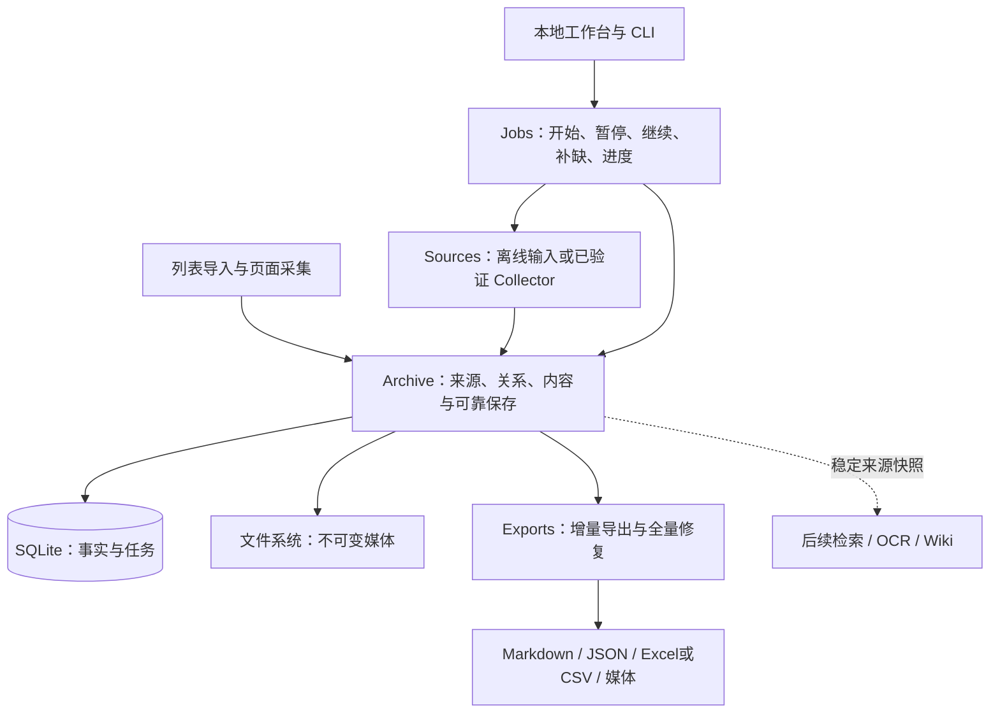

# Rednote Sync 架构审查与重构提案

状态：**日期化架构审查与实施复核。** 分项修复已获用户批准并实施；其余方案仍为未采用的候选探索，不因归档而被判定采用或废弃。Core 修复日期为 2026-09-12；2026-09-14 的脚本、页面判定与 DSH 对话复核见[第 11 节](#11-2026-09-14-dsh-对话复核)。当前产品状态以[路线图](../design/roadmap.md)为准，当前 Core 运行行为以 [Core 实现契约](../../projects/docs/sync-core.md)为准。

最初按“先备份、给方案、获准后修改”完成审查。随后用户明确批准修复摘要中的六类 Core 问题：合法内容误拒、失败隔离、更新语义、存储开销、账号身份拆分和工程门禁。实施结果见文末。新工作台、在线采集、真实数据迁移和其他原型问题没有因此自动获准。

**阅读边界：**下文审查发现、原始行号和基线测试指向备份时的代码。源码链接打开当前文件，链接文字中的“原 L…”保留审查时行号；重构后应在原始备份中复核，不把旧行号当作当前代码定位。本机私有备份未上传，文中仅保留其相对仓库根目录的位置。第 6–9 节保留最初完整候选方案及审批范围，不表示其中每个设计都已采用。

## 1. 判断与建议

项目确有过度防御，而且已经造成合法内容无法保存、正常任务被失败项阻塞、更新数据不准确。主要原因是：内部接口暴露了太多中间状态，随后用重复校验、能力认证、全量投影和撤销机制维护这些状态的一致性。另一些复杂度来自研究阶段的实验控制，不应照搬成产品流程。

**我的建议是批准下文方案 B：在现有项目内重建简洁的归档与任务边界，分批替换内核。** 保留可验证的数据保证、旧输入兼容和回退路径，删除只为维持旧实现结构而存在的机制。第一批完成可靠的本地闭环，再接经过验证的在线采集能力。

目标系统是一个本地单体应用：SQLite 保存事实和任务，文件系统保存不可变媒体；少量业务操作隐藏采集、合并、恢复和导出细节。性能首先来自不做重复工作、流式处理和缩短事务，换语言不是本轮提速依据。

## 2. 备份、范围与验证

### 备份

备份说明（本机私有：`.local/backups/before-architecture-review-20260912-102751/README.md`）所在目录包含：

- `working-tree.tar.gz`：247 个当前自有文件，含未提交、未跟踪的代码和文档。
- `history.bundle`：Git 历史；备份 HEAD 为 `0713ec1fcfbaf77392b0c518a36029ec68550bb9`。
- `manifest.json`：逐文件 SHA-256、权限及归档摘要。
- `status.txt`、`staged.patch`、`unstaged.patch`：当前工作区与暂存状态。

归档已在独立临时目录解压，247 个文件的内容摘要与权限一致；Git bundle 验证通过。它是代码、文档与 Git 备份，不覆盖真实媒体库、凭据、浏览器会话、HAR、第三方副本及依赖。正式数据迁移前仍需为当时的数据目录制作可恢复快照。

### 审查覆盖

| 层次 | 本轮范围 | 证据边界 |
|---|---|---|
| 需求与操作流程 | 产品设计、账号角色、路线图、现有 CLI 与脚本流程 | 以已确认需求为基准；未确认的 AI/Wiki 功能仍是探索 |
| 列表采集 | 三份 Tampermonkey 脚本 | 静态审查与隔离函数合成复现；未操作真实网页 |
| 在线采集实验 | 自有浏览器、协议、登录、编排及诊断代码 | 静态审查、119 项离线测试；未读取真实凭据或发送平台请求 |
| 任务与领域逻辑 | Core 输入、调度、失败、合并、进度和 CLI | 静态审查、合成复现、现有测试 |
| 存储与导出 | SQLite、对象、路径、权限、projector、验证和恢复 | 静态调用链、合成输入、计数与耗时测试 |
| 工程与扩展 | 构建、打包、测试；Notion、媒体检查、OCR、Wiki 前置工具 | 原型按各自用途评价；未运行真实下载、OCR 或媒体解码 |

Core 自有源码约 5,427 行、测试约 4,398 行、构建检查脚本约 1,392 行。这些数量用于定位工作量，不作为代码质量的判据。审查不包括第三方 `source/`、`reverse-skill/` 或私人数据。

### 重构前基线

在备份解压副本上执行，Core 使用本机 Node v26.0.0 / macOS：

| 检查 | 结果 |
|---|---|
| Core `npm run check` | 通过，7.51 秒 |
| Core `npm test` | 165/165，通过，176.10 秒 |
| Core `npm run pack:check` | 失败：`README relative link must resolve inside the package` |
| 实验工具 `unittest discover -s tests` | 119/119，通过；使用实验现有虚拟环境，全部为离线替身/合成输入 |
| Wiki 前置工具 `unittest discover` | 37/37，通过 |

实验套件首次用系统 Python 运行时缺少 Playwright/httpx/xhshow，改用项目已有虚拟环境后通过；没有安装新依赖。测试通过说明既有约束成立，不代表这些约束都符合当前产品需要。

另做一次无媒体基准：100 篇合成正文、每页新增 10 篇、间隔设为 0，单进程顺序执行。计时含每次打开与解码输入，目录计数只统计归档内部两个 `notes` 目录返回的文件名数量。

| 处理后总帖数 | 本次新增 | 本次耗时 | 本次遍历的笔记目录条目数 |
|---|---:|---:|---:|
| 10 | 10 | 0.786 秒 | 110 |
| 50 | 10 | 1.560 秒 | 4,370 |
| 100 | 10 | 2.702 秒 | 18,470 |

这是单次合成测量，不是吞吐 SLA，也不能外推真实平台速度或大媒体峰值内存。它确认新增工作量相同时，历史库规模仍显著增加本次开销。基准脚本与结果（本机私有：`.local/backups/before-architecture-review-20260912-102751/audit-evidence/README.md`）随本地备份保存。

## 3. 从需求反推必要结构

依据[产品设计](../design/product-design.md)与[账号模型](../design/account-identity-model.md)，优先完成个人 2000+ 点赞/收藏内容的可靠归档。系统需要保证：

1. 知道列表属于谁、由谁取得、哪些条目已收录；不把滚动停止当成完整性证据。
2. 允许小号采集主号列表中的内容，再由主号补全选定缺口；关系归属始终准确。
3. 正文、每份媒体、每次尝试分别有结果；一项失败不丢失其他项的成果。
4. 重启、重复导入和重试都能继续；本地导出失败不触发无必要的平台访问。
5. 用户能看懂剩余工作，打开真实可用的本地文件；只有实际满足条件才显示完成。

这里没有要求分布式多写者、任意不可信进程内插件、每页全库导出瞬时原子切换，或个人 MVP 的严格 npm 发布供应链。这些不应主导内核设计。

## 4. 逐层发现与处理意见

优先级含义：**高**为已损害语义或明显阻挡规模/确认需求；**中**为维护成本、扩展障碍或尚未实测的局部风险。每项都说明保留的保证。

### F01 · 高：宽松兼容把错误列表和假身份写进结果

两个点赞脚本在未知列表端点上依据“当前点赞 tab”及字段形状接受响应，没有逐条排除 `liked:false`。合成测试中，收藏响应的未点赞记录被两个脚本接受。缺失 `note_id` 又变为 `Unknown`；两个坏条目据此被合并为一个假帖子。收藏脚本还使用 `||` 将有效的点赞数 0 变为未知值。

证据：[点赞响应判定（原 L226）](../../prototypes/tampermonkey/xiaohongshu-like-export.user.js)、[JSON 版判定（原 L222）](../../prototypes/tampermonkey/xiaohongshu-like-export-json.user.js)、[占位身份（原 L301）](../../prototypes/tampermonkey/xiaohongshu-like-export-json.user.js)、[收藏字段与去重（原 L237）](../../prototypes/tampermonkey/xiaohongshu-collection-export.user.js)。

处理：采集入口根据请求来源、请求时列表上下文和被扫描账号验证关系；强制 ID 缺失则记录坏条目并继续，未知值只在 UI 显示。保留已验证的端点兼容，去掉“猜成成功”的 fallback。这也覆盖既有 BUG-001。

### F02 · 高：列表采集缺少持久任务与完成定义

脚本只有内存清单、计数和滚动定时器；`localStorage` 保存的是面板位置。刷新或进程退出后没有清单断点，停止滚动也不证明已取得全部记录。

证据：[清单与滚动（原 L343）](../../prototypes/tampermonkey/xiaohongshu-like-export-json.user.js)、[面板状态（原 L383）](../../prototypes/tampermonkey/xiaohongshu-like-export-json.user.js)。

处理：逐页持久化条目、来源和 checkpoint；仅在可信分页结束信号出现时标记完整，否则显示“完整性待确认”。若本地端不可达，浏览器侧先可靠缓存并等待接收确认，不能靠重复滚动猜哪些数据已保存。

### F03 · 中：同一采集能力复制成三套程序

三份 userscript 共 1,477 行，重复捕获、映射、拖动、主题与滚动逻辑。两份点赞脚本同时安装页面与 sandbox hook；页面 hook 过滤 URL 前已复制并读取响应正文。收藏逐条 `Array.some` 去重也会随列表增长重复扫描。

证据：[页面 hook（原 L145）](../../prototypes/tampermonkey/xiaohongshu-like-export-json.user.js)、[第二套 hook（原 L261）](../../prototypes/tampermonkey/xiaohongshu-like-export-json.user.js)、[收藏去重（原 L249）](../../prototypes/tampermonkey/xiaohongshu-collection-export.user.js)。

处理：一个列表采集实现，JSON/Excel 为输出选项，使用 ID Map 去重、先过滤响应再解析。双 hook 曾解决首屏遗漏，应先覆盖 `document-start`、SPA、fetch/XHR 和首屏回归，再删除重复路径。没有这些回归就直接删监听，会损失功能。

### F04 · 高：粗糙的风险检测误判作者正文

实验对整页 `body.inner_text` 搜索“验证码”“请先登录”“页面不见了”。正常文章讨论这些词也会触发风险或 `DETAIL_NOT_FOUND`；读取 body 失败甚至直接当作不存在。隔离纯函数的合成文章已复现。

证据：[整页关键词检测（原 L140）](../../research/reverse/targets/xhs-xsec-token/experiment/scripts/capture_visit.py)、[详情判定（原 L239）](../../research/reverse/targets/xhs-xsec-token/experiment/scripts/capture_visit.py)、[会话检测（原 L40）](../../research/reverse/targets/xhs-xsec-token/experiment/scripts/session.py)。

处理：区分明确 HTTP/API 风险、可见挑战控件、平台错误页结构和作者正文。读取失败标记“无法确认”，不能标记已删除。真实身份不匹配、挑战、拒绝访问和限流仍暂停相应会话。

### F05 · 中：实验规程和产品采集能力混在一起

固定“身份→搜索→详情”、第一页限制、按事件数核对顺序、跨账号全局锁和每日次数台账，是当前小实验的边界。浏览器路径还每次启动登录子进程、创建 staging、校验后关闭，再启动 capture 并复核身份。照搬成批量产品会导致大量例外和重复初始化。

证据：[协议顺序（原 L156）](../../research/reverse/targets/xhs-xsec-token/experiment/scripts/protocol_session.py)、[实验台账（原 L65）](../../research/reverse/targets/xhs-xsec-token/experiment/scripts/common.py)、[实验编排（原 L190）](../../research/reverse/targets/xhs-xsec-token/experiment/scripts/run_experiment.py)、[登录生命周期（原 L142）](../../research/reverse/targets/xhs-xsec-token/experiment/scripts/login_profile.py)。

处理：实验工具和策略保留在研究目录；生产 Collector 隐藏会话与访问材料，实验调用者在外层施加小实验限额。新增/更新账号与执行批次分开。未知异常不能一律归为传输失败，应保留脱敏后的失败环节和恢复建议；见[宽泛异常边界（原 L167）](../../research/reverse/targets/xhs-xsec-token/experiment/scripts/protocol_session.py)。

本轮不会取消实验限制或解锁在线操作。[实验最新记录（原 L3）](../../research/reverse/targets/xhs-xsec-token/experiment/README.md)已到 9 月 11 日：F 身份复核通过、搜索 461，未取得目标详情。路线图较旧，批准实施后应修正文档状态漂移；这不是在线能力已稳定的证据。

### F06 · 高：离线内核实际是单页远程请求模拟器

Core 默认每次 5 条、最多 10 条、间隔 10 分钟。FixtureSession 一生只允许一次 `listPage`，每次 CLI 又完整读取、解码 envelope。接口名虽然是 `RednoteClient`，SyncEngine 实际只接受 WeakSet 认证的具体 FixtureSession，无法正常注入另一个采集实现。

证据：[引擎构造限制（原 L195）](../../projects/src/sync-engine.ts)、[单页限制（原 L509）](../../projects/src/offline-input.ts)、[完整解码（原 L550）](../../projects/src/offline-input.ts)。

处理：离线输入一次提交后持续执行；分页只属于列表来源，网络节流只属于真实 Collector。FixtureSession 降为旧格式兼容转换器和测试数据工厂，删除生产内核对其身份的依赖。保留输入大小、结构与真实来源检查。

### F07 · 高：一个 account 被迫承担三种身份

会话账号、列表 scope、详情 account 和关系 owner 必须相同。这无法表达已确认的“小号采集主号清单，再由主号补缺”，简单删除 `sameAccount` 检查又会造成归属混淆。

证据：[输入身份约束（原 L298）](../../projects/src/offline-input.ts)、[引擎身份约束（原 L206）](../../projects/src/sync-engine.ts)。

处理：帖子以平台+帖子 ID 定位；关系记录 owner 与列表来源；每次内容尝试记录 collector。校验这三种实际关系，不要求它们全相等。旧 v1 导入保留其声明账号，未记录的 collector 标为未知，不能虚构已验证身份。

### F08 · 高：单帖失败阻塞其他帖子与列表进度

详情异常被赋给全页 blocker，剩余项目不再处理；cursor 又必须等所有项目 terminal 才前进。合成的一页两帖中，第一帖详情失败、第二帖合法，结果 `detailCalls=1`，第二帖 pending、cursor 为 null。

证据：[失败分支（原 L392）](../../projects/src/sync-engine.ts)、[进度条件（原 L28）](../../projects/src/progress.ts)。

处理：列表接收 checkpoint 和内容任务进度分开；每条清单可靠入库后可推进分页，单帖失败留下缺口再继续。认证/限流/挑战暂停对应 Collector，本地存储损坏停止写入。不能把所有错误统一为“继续”或“全停”。

### F09 · 高：为合并可交换性牺牲用户数据语义

昵称取字典序最大、指标取历史最大、标签取并集，同时间正文用 hash 字典序决定胜者。合成复现：新正文已经接受，但删掉的标签仍保留，点赞 20→15 仍显示 20，昵称 Zulu→Alpha 仍为 Zulu。

证据：[昵称与指标（原 L29）](../../projects/src/merge.ts)、[标签合并（原 L176）](../../projects/src/merge.ts)、[摘要排序（原 L92）](../../projects/src/rank.ts)。

处理：当前值由明确的观测与版本规则选择，历史尝试另存。最新完整来源标签可替换旧来源标签，个人标签独立；最新已知指标允许下降。缺失字段不覆盖已有值，成功媒体不被后续下载失败抹掉。不完整清单中未出现某帖，也不能当作用户取消关系。此项改变当前合并语义，需随方案批准。

### F10 · 高：凭据扫描拒绝合法正文、网址和媒体

通用扫描把长字母数字串当作 token，拒绝任何带 query/hash 的网址，并把二进制也解码为 UTF-8 扫描。合成结果：普通正文通过；公开 SHA-1 校验值被拒；`https://example.com/article?id=123` 被拒；带公开 checksum 注释的合成 1px GIF 被拒。

证据：[字符串扫描（原 L34）](../../projects/src/secrets.ts)、[二进制扫描（原 L65）](../../projects/src/secrets.ts)、[对象写入调用（原 L134）](../../projects/src/object-store.ts)。

处理：在采集边界将 Cookie、签名、请求头、临时访问链接与归档数据分开；日志只输出允许字段，并脱敏已知凭据。删除按内容外形猜凭据的正文/二进制拒绝规则。帖子公开 URL、临时访问 URL、作者正文中的普通链接必须分别处理。

### F11 · 高：写事务覆盖等待、采集与全库导出

`BEGIN IMMEDIATE` 在 `listPage` 前取得，直到逐帖等待、媒体处理、全库投影和收据复核后才 commit。现在输入是离线 fixture；若沿用此结构接入在线 Collector，网络等待也会占住写锁。

证据：[事务开始（原 L323）](../../projects/src/sync-engine.ts)、[事务中的等待与采集（原 L378）](../../projects/src/sync-engine.ts)、[导出后提交（原 L220）](../../projects/src/sync-engine.ts)。

处理：采集与媒体暂存不持数据库写锁；用短事务提交一个结果或小批结果及对应任务状态；提交后导出。SQLite WAL 可让读写并行，但仍同时只有一个写者，不能用 WAL 掩盖长写事务。[SQLite 官方说明](https://sqlite.org/wal.html#concurrency)

### F12 · 高：媒体名为流式，实际反复整读且整库驻留

离线媒体先完整读入，再一次 enqueue 成 stream。全新媒体成功 commit 前，静态调用链至少有七次本地整文件读取：临时 MIME 检查、发布 verify、扩展名检查、入库 verify、入库扩展名复核、assets 投影、最终输出收据检查；不含读取原始源文件。另有多遍摘要处理。

证据：[伪流式输入（原 L352）](../../projects/src/offline-input.ts)、[对象重复读（原 L153）](../../projects/src/object-store.ts)、[媒体扩展名（原 L247）](../../projects/src/object-store.ts)、[入库重复验证（原 L791）](../../projects/src/state-store.ts)、[输出收据读回（原 L202）](../../projects/src/projectors.ts)。

[AssetsProjector（原 L600）](../../projects/src/projectors.ts)还把账号所有媒体的完整 bytes 收集到数组，返回后才逐个写出。保留在数组中的字节量随整个媒体库增长；不是只随当前下载大小增长。这是静态结构结论，未做真实大媒体 OOM 实验。

处理：块式流入，一次计算 hash/字节数并嗅探必要头部，原子发布后登记；已有可信对象通过元数据复用。导出流式复制并只处理变更项。完整重哈希和深度解码属于显式完整性检查，不能每次同步都全库执行。

### F13 · 高：路径校验和数据库枚举放大全量导出的成本

每次写出文件都重新检查根路径各级，再 `readdir` 检查大小写/Unicode 冲突。两个各含 N 文件的笔记目录，仅最终文件名检查就约有 `2N²` 个名字参与遍历，而这些文件名本来就是程序生成的固定前缀与摘要。前文 100 帖基准已经确认增长。

证据：[目录碰撞扫描（原 L23）](../../projects/src/paths.ts)、[每次重校验（原 L68）](../../projects/src/paths.ts)、[每个输出文件的调用（原 L282）](../../projects/src/projectors.ts)。

此外，[manifest 枚举（原 L1105）](../../projects/src/state-store.ts)每次为 `1+2N` 个 SQL 查询，notes/assets/index 三次全量枚举至少 `3+6N` 次，未计其他查询。这是调用结构推算。

处理：外部任意路径在入口校验；程序管理的摘要路径使用固定构造与必要的 no-follow/类型检查，不反复扫描兄弟目录。SQL 使用按变更 ID 查询或批量查询；全量维护显式运行。可信根的生命周期与最终文件打开仍要检查，不能直接取消路径边界。

### F14 · 中：内部状态重复，以及用认证对象维护重复状态

SQL 列、`record_json`、manifest 媒体和 `media_slots` 保存重叠事实，读回再逐项比较。调用方同时交 candidate、合并后的 manifest、期望 revision、失败发生记录和最终失败记录，仓储再合并一次证明调用方没算错。多个 WeakSet/WeakMap、Symbol 和摘要用来认证同进程中间对象。

证据：[重复存储（原 L116）](../../projects/src/state-store.ts)、[认证对象（原 L399）](../../projects/src/state-store.ts)、[二次计算（原 L767）](../../projects/src/state-store.ts)、[读回比对（原 L1075）](../../projects/src/state-store.ts)、[rank 认证（原 L6）](../../projects/src/rank.ts)。

`contentHash` 与 `indexEntrySha256` 甚至是对相同公开投影做相同 canonical JSON/SHA-256，数学上同值，见[前者（原 L146）](../../projects/src/merge.ts)与[后者（原 L221）](../../projects/src/merge.ts)。

处理：由 Archive 独占合并、事务和状态计算，调用方只提交观测结果。每个事实一个权威表示；JSON 可用于不需查询的复合字段，不能与 SQL 列双写同一整条记录。删除重复 hash、对内公开的 write-plan/business-result 认证。JSON/Markdown/CSV 是导出，不再作为保存帖子的前置 canonical 对象。保留事务、外键、必要版本检查和真实输入校验。

### F15 · 中：构建与测试在保护实现形状

零开发依赖规则促成自制 TypeScript specifier lexer、受限 Schema evaluator 和多份手工清单。lexer 连模板表达式里的除法也拒绝；static-check 要求至少 22 个源文件；发布策略逐字段锁定版本、平台、所有脚本和空开发依赖，却没有 `tsc` 类型检查门禁。

证据：[文件数量约束（原 L19）](../../projects/scripts/static-check.mjs)、已删除的自制转换器见备份说明（本机私有：`.local/backups/before-architecture-review-20260912-102751/README.md`）、[发布策略（原 L34）](../../projects/scripts/release-package-policy.mjs)。

处理：采用标准 TypeScript 编译/类型检查，选择一种边界 Schema 定义与验证方式；允许少量固定开发依赖。删自制编译子集、最低文件数量、重复枚举脚本和测试内部 WeakSet 的要求。保留可安装产物、包内文档链接、敏感材料不入包、构建一致性及真正业务/恢复测试。当前 Node 类型擦除本身不检查类型，且不能用于依赖目录中的 TS 分发，属于工具行为而非编译器替代品。[Node 官方说明](https://nodejs.org/api/typescript.html#type-stripping)、[TypeScript 编译器说明](https://www.typescriptlang.org/docs/handbook/compiler-options.html)

macOS/Node 26 可暂时保留为验证基线；新增平台支持另按能力测试决定，不为本轮重构顺带承诺全平台。

### F16 · 中：Notion/Wiki 原型出现第二条归档模型与过宽净化

Notion 审计→独立 corpus→视频台账→Wiki bundle 形成与 Core 不同的模型。作为一次性研究有价值，若长期产品化为另一条主干，会重复来源、媒体状态与增量逻辑。[Wiki adapter（原 L414）](../../prototypes/llm-wiki-prep/import_notion.py)、[独立摘要说明（原 L23）](../../prototypes/llm-wiki-prep/check_wiki.py)。

此外 `clean_text` 把所有普通链接的 query/hash 删除。已合成复现：`https://example.com/article?id=123#section2` 变为 `https://example.com/article`，可能丢失文章身份和引用定位。[链接净化（原 L69）](../../prototypes/llm-wiki-prep/import_notion.py)

[视频下载（原 L218）](../../prototypes/notion-stage3/download_videos.py)复用前整文件重哈希，下载成功又全片 ffmpeg 解码。这在一次性完整性审计中合理；放进日常采集流程应改为分级验证。[深度解码（原 L169）](../../prototypes/notion-stage3/download_videos.py)

处理：Notion 作为输入适配器，未来统一进入 Archive；Wiki/OCR 消费稳定的来源快照及媒体引用，自身索引和派生摘要仍可存在，不回写来源事实。继续保留引用校验、个人笔记保护、“没有 OCR/转写就没有相关证据”的规则。当前 39 行 Apple Vision OCR 工具边界清楚，没有理由仅因多一种语言而重写；ZIP 防越界、防覆盖和容量检查也应保留。

## 5. 三种架构选择

| 方案 | 做法 | 收益 | 代价与局限 |
|---|---|---|---|
| A · 修补现有内核 | 修误判，流式媒体，优化查询/投影，继续保留现有接口 | 初期变化较小 | owner/collector、全页事务和派生回滚仍相互牵制；较容易继续加例外 |
| **B · 重建边界、分批替换** | 同一项目内建立 Archive/Jobs/Sources/Exports，旧格式经转换导入，新库副本比对后切换 | 同时解决功能语义、性能和认知成本；每批可验证、可回退 | 需要明确批准合并语义、逐项提交和导出完成语义的变化 |
| C · 全项目一次重写 | 同时更换语言、采集工具、数据库布局和 UI | 初期结构自由 | 外部采集仍未验证；一次丢失多个可工作的基线，定位回归和迁移更难；没有测量支持额外收益 |

我倾向 B。重写范围集中在高耦合内核，已清楚的小工具保留或适配，最终删除被替换的生产路径，不长期维护两套内核。

## 6. 方案 B 的候选设计

### 模块与使用流程



这是一个进程内的四个模块，不是四个服务。数据写入统一由 Archive 管理；Jobs 的任务也存在同一 SQLite 中，只有一个写者。纯合并与格式化直接作为普通函数；SQLite/文件系统用真实临时目录测试；实际平台才是需要替身的外部边界。先不建立通用平台插件、事件总线或分布式队列。

用户流程：**导入/采集清单 → 确认关系归属 → 选择内容采集账号 → 开始 → 查看缺口 → 对选定缺口换账号补全 → 打开归档。**

工作台首屏展示总数、完整保存、处理中、待检查和暂停原因；详情区区分“内容已保存”与“导出已完成”。暂停停止领取新任务，保留已提交成果；继续恢复未完成项。用户不需要理解 token、profile 路径、schema 版本、实验事件数或投影 generation。

### 小接口，完整业务能力

存储模块只需少量入口，例如：

```ts
archive.ingest(listBatchOrCaptureResult)
archive.read(libraryQuery)
archive.export(exportRequest) // 流式返回进度，含最终完成结果
```

UI/CLI 经 Jobs 发起 `start / pause / resume / retryMissing`，并订阅进度。Collector 对任务层只提供 `fetch(noteRef, neededParts, signal)` 及会话状态；重试使用同一方法，不再另设 RetrySource。它内部可进行必要的访问材料发现，但不对任务层泄露凭据或签名操作。暂不可用的 Collector 应明确标为不可用。

这些名称用于审查边界，不是要求现在冻结公共 SDK。存储事务、manifest、收据、内部排序和错误归并不进入调用接口。

### 数据模型与更新规则

| 事实 | 单一职责 |
|---|---|
| 帖子与观测版本 | 平台+帖子 ID 标识；保存所选当前内容与必要的来源/版本历史 |
| 列表关系 | owner、点赞/收藏/收藏夹、列表来源与接收 checkpoint |
| 采集尝试 | collector、观测时间、结果、失败环节；实际未知身份保持未知 |
| 媒体需求与 Blob | 每份所需资源及已有对象 hash；顺序是展示属性，不能单独用 ordinal 当永久资源身份 |
| 作业与工作项 | 用户选择的范围、当前处理阶段、恢复位置和尝试关联 |
| 导出待办 | 需重建的帖子/格式与最后成功版本；可由已提交事实恢复 |

不预先把每个概念拆成一个独立框架。可查询字段用 SQL 列，不需查询的复合来源元数据可以用 JSON；不同时维护整条 SQL 记录和其完整 JSON 镜像。UI 计数优先查询/聚合，不再保存多份必须互相校验的计数和失败 ID 列表。

候选更新规则：有可靠源版本时按版本比较；否则使用可靠的采集观测时间，不能用导入或迁移到达顺序代替。同一采集结果有固定身份，重复导入不生成“更新观测”；旧文件晚导入也不能覆盖较新内容。缺乏可靠版本/时间或相同版本正文不同时保留冲突来源，不用 hash 大小猜新旧。旧版、缺字段或失败结果不抹掉现有完整内容。标签区分来源标签和个人标签；媒体按来源资源身份/版本合并，不能把不同版本的同序号图片默认为同一份。关系取消需明确证据，本轮不新增根据不完整清单自动删除关系的行为。

### 保存与恢复

1. 清单条目与下一页 checkpoint 在一个短事务内保存；随后内容工作独立排队。
2. Collector 在事务外取得正文和媒体。文件按块写入 staging，同时计算摘要、字节数和必要 MIME 信息；限制在途队列和缓冲区。
3. 媒体先耐久、原子发布，再在短事务内提交内容/媒体引用、尝试结果、工作项状态和导出待办；提交前重查必要版本，避免覆盖并发的新状态。
4. 导出提交后按变更项执行，单文件用原子替换。导出失败只重做本地导出；重启重领未完成工作。
5. 发布后、DB 提交前退出可能留下孤立对象；允许存在并由显式维护安全回收，不能为了避免孤立对象把网络和全部文件操作包入写事务。

**六项修复中已批准并采用的变化：**不再保证暂停时撤回整个页面及所有派生文件；改为已提交的逐项成果保留，派生文件单独恢复。完整快照导出如果需要跨文件一致，读取固定数据库快照并输出新目录，全部成功后标记该次导出完成；无需每页模拟全库文件事务。

每个 Collector 的网络并发和节流由已验证策略约束；先串行复用会话。离线写入、格式化、媒体流使用有上限的流水处理，提高本地效率不依赖提高平台请求频率。增加 CPU worker 需由 OCR/解码测量决定。

### 验证放在真正的边界

| 保留 | 收拢或删除 |
|---|---|
| 外部文件/响应的 schema、ID、大小与来源验证 | 可信内部对象每经过一层重新解码、冻结、WeakSet 认证 |
| Cookie/签名隔离、日志允许字段与真实凭据脱敏 | 任意长字符串当 token、全二进制 UTF-8 扫描、普通链接一律去参数 |
| 根目录与导入路径边界、最终 no-follow/文件类型检查 | 对固定摘要路径每次重新枚举所有兄弟文件 |
| SQLite 事务/外键、流式 hash、原子发布 | canonical 字段与 record_json 双写复核、重复摘要、全页持锁 |
| 单帖/媒体缺口、真实身份/挑战/限流暂停 | 一条详情失败就停止无关任务；实验三请求流程变成产品流程 |
| 显式 verify、修复、备份与恢复测试 | 每页全库重哈希、全媒体驻内存、派生视图撤销框架 |

## 7. 实施顺序、验收与回退

以下是最初候选批次。用户随后批准的六项问题覆盖了批次 1–4 的本地内核内容，实施时采用兼容现有数据库的简化方案；没有逐项照搬新 Archive/Jobs 框架，也未批准批次 5 的新工作台或执行批次 6。每批验证后继续，非本任务未提交工作保留。

| 批次 | 工作 | 完成标准 |
|---|---|---|
| 1 · 固定行为与工程入口 | 记录现状基线及本轮反例的目标验收清单；修包内链接；引入标准编译与单一 schema 方案，删代码形状门禁 | 类型检查、本批应保持的现有行为、包安装/CLI 冒烟通过；目标语义测试随后续对应批次实现 |
| 2 · 新 Archive 与旧输入导入 | 明确 owner/collector、更新语义；建立新库与兼容转换；让正文/媒体保存不依赖导出 | v1 合成输入可导入；未记录来源不被虚构；旧新正文、关系、媒体与缺口可比对 |
| 3 · 新 Jobs 与流式存储 | 持久工作项、失败隔离、短事务、流式媒体、只补缺；替换 FixtureSession 生产依赖 | 单帖失败不中断其他项；重复导入幂等；进程中断可恢复；本地失败不产生额外平台调用 |
| 4 · 增量导出与删除旧内核 | 增量 JSON/Markdown/索引、显式 verify/repair；删重复 manifest/receipt/认证与撤销路径 | 新增一帖不重读旧媒体、不重写无关笔记；导出失败可独立恢复；没有双内核长期并行 |
| 5 · 外层操作闭环 | 统一列表采集与输出选项、持久扫描进度、本地工作台；保留 CLI | 合成环境覆盖首屏/分页/刷新/暂停/换号补缺；操作状态与真实保存结果一致 |
| 6 · 数据迁移与在线验收 | 对经用户允许的数据快照迁移；接入已验证 Collector，逐步真实验收 | 迁移对照无遗漏、原库保留；真实账号/平台验收遵循当次授权，未验收能力不显示为可用 |

批次 1 先区分现状与目标，不能要求尚未修复的行为已经通过。合法内容保存与更新规则在批次 2 通过目标回归，失败隔离与恢复在批次 3，增量导出在批次 4，采集误判和完成状态在批次 5。改变旧规范的测试须随批准的语义一起替换；不能为迁就旧测试再把旧结构移植进新系统。

迁移在副本上建新库，源库只读；不对原 SQLite 就地试错。兼容导入保留旧的声明账号、历史运行/失败、媒体 hash 和旧版来源信息。对比包括帖子数、关系数、正文与来源、对象摘要、任务缺口、可用导出。如果某个旧库确实经历旧合并而丢失了原始昵称、标签或下降指标，这些原始观察无法仅从该库恢复；迁移保留 legacy 快照和不确定性，只有原始观测或后续采集才能校正，不能凭新规则重造历史。这是候选迁移的条件性风险，不是用户真实库发生损失的实测结论；本轮实现兼容旧 schema，不以迁移为升级前置条件。后续观测造成的昵称/标签/指标变化按批准的新规则验收；格式元数据变化单独对照。真正切换前再取当时的完整数据快照；切换后产生的新结果单独保存，回退不得覆盖或丢弃这些新增成果。

## 8. 性能与可靠性验收目标

这些是候选目标，不是已实现成绩。固定同一机器、样本与计时边界，再比较新旧；优先检查工作量是否正确，再看秒数。

| 场景 | 候选验收标准 |
|---|---|
| 2000 条无媒体清单 | 一次操作可持续完成；可暂停/恢复，不需用户逐页触发或等待离线节流 |
| 2000 条库中新增 10 条 | 旧媒体读取字节数为 0；无关逐帖导出不重写；目录不出现随 N² 增长的遍历 |
| 相同 100 条无媒体基准 | 初步目标总耗时至少下降 50%；未达到时依据 profile 修正，不能牺牲持久化保证换成绩 |
| 单份 512 MiB 合成媒体 | 主要传输内存随缓冲区而非文件大小增长；候选目标相对空闲基线 RSS 增量不超过 64 MiB，默认小并发 |
| 多媒体归档增长 | 导出不同时保留全库媒体 bytes；增量工作量随变化条目/字节增长 |
| 事务与进度 | 事务中没有网络等待或全库投影；普通单帖提交 p95 初步目标低于 50 ms，进度可见延迟低于 250 ms |
| 新对象保存 | 正常路径一次流式摘要，不因 MIME/扩展名/入库反复整读；深度 verify 单独计费、计时 |
| 中断与故障 | staging、发布后、commit 前后、导出中真实杀进程测试；已提交引用可用，未完成状态可恢复，不假报完成 |
| 故障隔离 | 详情失败、媒体失败、账号失效、格式变化、磁盘满分别有正确作用域与恢复动作 |
| 跨账号补全 | 主号关系不变，小号/主号尝试留源；只处理获选缺口，成功媒体不被失败覆盖 |

暂停、恢复、原子保存和对象校验本身都要保留；可以去掉的是实现它们时多余的层次和重复工作。

## 9. 最初提议的审批范围（后续以六项修复授权为准）

建议批准 **方案 B 与批次 1–5 的本地实施**，包含四项明确变化：

- 用标准工具与少量固定依赖替代零依赖自制编译/检查框架。
- 将 owner、列表来源、内容 collector 分开；旧格式通过兼容导入保留。
- 用符合更新语义的当前值选择替代昵称字典序、指标最大值和永久标签并集。
- 用逐项可靠保存和可恢复导出替代整页/整套派生文件回滚。

批次 6 的真实数据迁移、凭据使用与平台验证在对应副本和适配器准备好后，按实际范围执行授权与验收。OCR/Wiki 产品化、平台写操作、发布及更换语言不包含在这次建议实施范围内。当前提案不会自动把这些未决事项变成产品要求。


## 10. 六项修复的实施结果

2026-09-12，本地 Core 已按用户选中的六项完成代码替换，对应原发现 F06–F13、F15。F14 只完成部分内部简化，保留旧字段与薄 API 兼容入口；不将该项整体标为完成。现行语义与边界以 [Core 实现契约](../../projects/docs/sync-core.md)为准。

| 获准问题 | 最终改动 |
|---|---|
| 合法内容被当作凭据拒绝 | 去掉 token 外形猜测与通用 URL 拒绝；保留明确凭据字段和已登记秘密值检查。标题、作者名、标签空白与媒体注释不再触发内部摘要矛盾 |
| 单帖失败阻塞后续正常项 | 列表检查点与任务分离；逐帖提交，详情/暂时网络/媒体错误留在对应帖子；暂停保留成果，重试只补缺 |
| 昵称、指标、标签更新错误 | 按输入的实际采集时间选择完整观察，允许昵称变化、指标下降/为 0、标签删除；旧重放不降低正文或媒体墓碑的时间 |
| 每页全量投影和媒体反复整读 | 一次 sync 连续分页后导出；媒体分块处理；旧文件依据收据直接保留；提交和导出分开，去掉整页撤销机制 |
| owner 与采集账号混淆 | owner 保持原分区，列表/内容 collector 可选独立记录；任务内容尝试和运行列表尝试分别留源，旧记录未知来源保持未知 |
| 自制编译和保护结构的门禁 | 标准 tsc、严格类型检查、固定开发依赖与 Ajv；删除最低文件数、固定源码名单和精确脚本形状要求；修复 README 包外链接 |

实施中对原候选更新规则作了明确收敛：用单一采集时间顺序消除有/无来源版本混用时的比较环；输入每个正文与指标字段均为显式快照字段，`null` 如实表示此次未知，不再用旧字段拼成虚假的新观察。来源 `revisionAt` 保留供追溯。成功媒体在后续下载失败时仍保留。这避免增加一套字段时钟或大规模 schema 迁移；较晚采集到的旧平台内容仍被视为较新观察，调用方必须如实记录采集时间。

同一备份生成的 100 篇无媒体基准，总耗时由 **16.947 秒降为 4.119 秒，减少约 75.7%**；累计达到 100 篇的第 10 页（本页新增 10 篇）由 2.702 秒降为 0.425 秒，笔记目录枚举条目由 18,470 降为 0。这里不是单篇耗时。相同新帖数量下不再有旧实现的目录遍历增长。

另一次合成验证一次处理 **2000 篇 / 20 页，68.40 秒**；随后新增 10 篇用时 **1.48 秒**，仅打开 20 个新正文产物，2000 份旧 Markdown 的 mtime 全部不变，笔记目录枚举为 0。2033 个 canonical 事务实测 p95 为 **3.18 ms**，单次最大 155.75 ms；没有将它描述成所有提交均低于 50 ms。

单份 **512 MiB** 合成媒体，64 KiB 分块，完成保存和导出，采集过程峰值 RSS 增量 **38.61 MiB**；随后完整 verify 通过。verify 本次额外 RSS 峰值约 99.83 MiB，仍有运行时分配/回收开销，不能把采集内存数字当作所有命令的内存上限。索引、元数据和文件属性检查仍为 O(N)，没有声称导出所有操作都是 O(变更数)。以上均为本机单次合成测量，不是实际平台吞吐或 SLA。

旧版本生成的 100 篇合成 SQLite 库已复制到独立临时目录，用新版本读取、verify、追加 1 篇后再次 verify：旧 100 份 manifest 全部保持等值，最终 101 篇，未迁移 schema。用户真实资料库、媒体和凭据均未读取或迁移。

最终集成：`npm run check` 通过（严格 TypeScript、编译一致性、离线运行/制品检查）；`npm test` **167/167**，无跳过；`npm run pack:check` 通过，两次 tarball 字节一致、35 个包内文件、8 项安装后 CLI 验收，运行依赖为 0。旧的最低源码数和语法子集测试已被行为测试替代，未把旧整页撤销断言算成当前功能要求。

实现保持单一运行主路径，仍保留必要的旧库字段和薄库 API 兼容层。研究脚本、用户真实库、在线账号操作、工作台、Wiki/OCR、发布和 Git 提交均不在此次六项修复的完成声明内。项目原有未提交工作保留；重构前备份继续可用。

离线演示 21 条命令、README 实际 7 条命令均通过。文档与 JSON 元数据检查通过；原始检查输出、合成性能脚本及结果已归档到修复后验证证据（本机私有：`.local/backups/before-architecture-review-20260912-102751/audit-evidence/post-refactor/README.md`）。两份 Wiki 文档在工作期间另有变化，本轮未编辑或回退它们，当前状态已保留。

## 11. 2026-09-14 DSH 对话复核

本节记录用户要求复核的 DSH「Reverse skill」对话，重点为“另外两份深读……回来我再补”之后的补充四、补充五及最终路线表。复核依据是当前自有代码、历史源码指纹、日期化研究记录和本轮合成测试；没有新增平台采集，也没有检查用户真实资料库。

修改前已保存并校验新的代码与文档备份（本机私有：`.local/backups/before-dsh-review-20260914-092118/README.md`）：264 个自有文件、Git 历史、工作区状态和逐文件摘要。既有未提交工作保留，不把提交状态当成功能验收结果。

### 对 DSH 判断的核查

| 判断 | 复核结果与处理 |
|---|---|
| BUG-001 已有一份未提交、尚未验收的修复 | 不成立。修复前三份脚本 SHA-256 与 9 月 9 日失败版本完全相同；DSH 指出的代码早已存在于该版本。完整脚本再次复现误收后才修复，见[缺陷复验](../history/2026-09-09-bug-audit.md#2026-09-14-后续修复验证)。mtime 和 Git 是否提交不能证明功能已修复。 |
| BUG-002 滚动按钮选择器错误 | 成立。实际创建的合成 DOM 中保留署名元素时，点击抛出空元素异常；已改用按钮事件引用，启停和再次启动通过回归。 |
| Core 只完成 F07–F13、F15 | 漏掉 F06。连续分页、默认离线间隔 0 和可注入的 `SyncSource` 已实现；F14 仅部分简化。原提案的编号与六类批准问题不是一一对应关系。 |
| 现有真实库已丢失数据，必须先迁移抢救 | 没有真实库检查支持该说法。旧合并确有条件性的数据损失风险；本轮 Core 兼容旧 schema，合成旧库读取、追加与校验已通过。候选批次 6 不是当前升级的必需步骤。 |
| verify 缺少的对象目录可由 repair-views 恢复 | 混淆事实源与派生文件。`verify` 只读；`repair-views` 只重建导出。丢失的事实对象需要备份或原始内容，详见 [Core 恢复边界](../../projects/docs/sync-core.md#6-事实源提交与导出)。 |
| 2.702 → 0.425 秒是第 100 篇的单篇耗时 | 单位错误：这是累计达到 100 篇的第 10 页，本页新增 10 篇。上文已明确计时边界。 |
| 协议搜索都被 461 堵死，浏览器路线当前已通 | 忽略了 [G 在 9 月 12 日的协议搜索成功](../../research/reverse/targets/xhs-xsec-token/experiment/protocol-method.md#2026-09-12-g-自有脚本身份及搜索成功)。F 失败和 G 成功都是特定会话的证据；浏览器 5/5 是 8 月 16 日的五个样本，不是同条件路线比较或当前全量能力。路线图已同步 G 成功与次日 A–F 失效的不同状态。 |
| 从 HTML 取得正文证明无需 feed、token 或 source | 只能证明那次已返回 HTML 包含正文；未验证省略访问材料后的请求。已修正[专题中的泛化措辞](../../research/topics/xsec-link-structure.md#63-新发现的字段与覆盖缺口)。 |
| 公开生成算法不存在，token 必须服务端生成，这条路可以排除 | 有限检索不能得出全域否定。[E-006](../../research/reverse/targets/xhs-xsec-token/evidence/E-006-external-survey.md)原文也存在这个问题，已收窄为当次可核验来源未找到可复现算法；发现层下发 token 与生成算法所在位置是不同问题。 |
| 五字段安全清单与脚本导出 token 构成矛盾 | 两种产物范围不同：五字段是历史实验的派生队列，原导出按私有归档处理。已在[该节](../../research/topics/xsec-link-structure.md#9-安全清单字段等待最新导出后生成)注明，未据此删除原始输出字段。 |
| “待删除区”缺少现行状态 | 导航缺口成立，含义需纠正：历史触发条件是完整对账确认点赞/收藏关系都消失，非作者删帖。已列入路线图未决问题，未擅自实施或判为废弃。 |
| 16 个研究项目、改名及供应链提醒 | 当前确有 16 份项目记录；`reajason-xhs` → `xhs` 的三份元数据和路径引用已齐全，实验方法 ID 保留。固定版本的供应链发现不代表已安装产品漏洞，也不要求恢复已删除的旧路径。 |

### 本轮实际修改与保留边界

- 脚本：修复 BUG-001、BUG-002，以及 F01 中假 ID、坏条目和数值 0 的问题；补齐首屏计数刷新。两份点赞脚本仍保留首屏监听与延迟响应处理，JSON/Excel 的已有输出用途保留。
- 页面判定：修复 F04。作者正文不再通过整页关键词触发登录、挑战或不存在；改看明确可见控件及精确状态通知。读取失败不再判为不存在，而是未确认或检查失败后停止；“暂时无法浏览”保留为未确认。HTTP 403/429/461、失效身份、身份不匹配及明确挑战仍停止。控件形态只经本地合成页面验证，不声称覆盖平台当前所有页面。
- 文档：修正产品设计的多账号实现状态、路线图的协议实验状态、扩展探索的旧阶段门禁措辞，以及小样本/SSR/token 研究的证据范围。

F01 中真实账号归属验证、F02 全量列表与持久恢复、F03 三脚本统一，以及工作台、真实在线适配器和知识库选型仍有待实施或决策。F05 的实验限制本身具有实验用途，F14 的兼容字段也有保留原因；不能把尚未采用某个候选结构直接当作运行缺陷。AI 分类、LLM Wiki 和完整四模块架构仍是探索，当前状态只见[路线图](../design/roadmap.md)。

### 验证与执行范围

- 脚本最终回归 **24/24**，无跳过；同一套测试在备份原脚本上为 6 通过、18 失败。另在临时副本中删除页面注入调用或 `liked` 分支，新回归分别出现 2、4 项失败，确认测试能识别这两种功能退化。页面和 userscript 的隔离 VM 仅共用事件桥；真实 Tampermonkey 沙箱仍未验收。
- F04 最终受影响回归 **27/27**，无跳过：9 项全新 headless Chrome 合成页面测试与 18 项会话测试；页面请求全部拦截，没有使用现有用户 profile。此前全套 165 项通过发生在最后一项挑战通知补充之前，不冒充最终全套复跑。
- 三份脚本语法、Python 编译检查、文档链接、JSON 元数据、忽略规则和 `git diff --check` 通过。Core 运行代码没有改动，未重复宣称或重跑第 10 节的全部性能基准。

一次全套测试包含了 16 项固定 SDK 的模拟传输测试，载入第三方源码但封锁 socket/DNS，使用合成账号；这是执行范围偏差，因此本轮不声称“零第三方源码执行”。后续检查已限定为受影响的自有测试。完整命令、失败与通过日志、范围说明见本轮验证证据（本机私有：`.local/backups/before-dsh-review-20260914-092118/verification/README.md`）。本轮未读取凭据或真实库，未发平台请求，未提交 Git。
