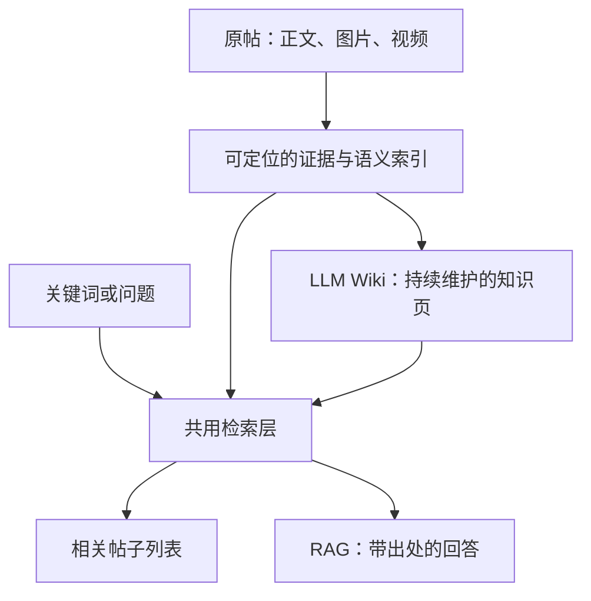

# 帖子库的语义检索、RAG 与 LLM Wiki

状态：**研究证据与候选方案**，尚未采纳为产品设计。核对日期：2026-09-13。
需求以[产品阶段三](../../docs/design/product-design.md#按含义搜索帖子)为准；已有边界与用例见[LLM Wiki 探索](../../docs/explorations/llm-wiki.md#按含义找回帖子)。本报告未读取私有帖子、安装模型或实现检索。以下区分主来源支持的机制、本项目建议和待测效果。

## 对当前需求的直接建议

**本项目建议：**RAG 与 LLM Wiki 可以共用同一套来源、检索及引用映射。当前先验证无字面重叠的相关帖子搜索；问答与 Wiki 都不是这项能力的先决条件。[RAG 原论文](https://arxiv.org/abs/2005.11401)研究检索证据如何辅助生成，[Karpathy 的构想](https://gist.github.com/karpathy/442a6bf555914893e9891c11519de94f)则把综合结果保存为持续维护的知识页。需要跨帖回答、比较或整理步骤时，加 RAG；同一主题被反复查询、综合结果需要复用和更新时，再加 Wiki。Wiki 可增加有来源的检索入口，是否提升召回仍须实测，原文不能证明它必然优于直接检索。

下图是候选分工；问答与 Wiki 可分别加入，共用底层资料：

## 共用来源与检索

**已知：**[RAG 原论文](https://arxiv.org/abs/2005.11401)将检索文档与生成模型结合；[Karpathy 的 Wiki 构想](https://gist.github.com/karpathy/442a6bf555914893e9891c11519de94f)持续维护关联知识页面，并在查询时检索页面。这些资料没有提供本项目场景下的优劣结论。

**建议：**共用原帖、证据块和检索入口：直接搜索返回帖子；RAG 根据找回的证据回答；Wiki 将有复用价值的综合保存成页面，也能被搜索。Wiki 命中应沿明确引用回到原帖，原文仍独立可检索。维护“来源版本—证据块—页面结论”的映射，源文变化后标记相关结论待复核；个人批注独立保存，派生内容不覆盖原始资料。搜索列表与回答上下文分开：RAG 只选部分证据送入模型，答案引用清单不能当作所有相关帖。这里是组合设计，未实现或验证，也不复现 RAG 原论文的训练系统。

## 短词、含义与用途

短词可能多义，例如“放松”可指身体练习、心态或视觉氛围。“能用于解决这个问题”还需要判断条件、步骤及因果关系，不能仅用主题相近替代。[BRIGHT 原研究](https://arxiv.org/abs/2407.12883)专门评估需推理才能识别相关文档的任务，说明普通语义匹配并未解决这类检索；其成绩不能直接外推到中文收藏。

建议保留原查询，并展示少量可能的意图；分别找“直接讨论”和“可能适用”的帖子，说明关联依据。沿用现有假设用例，只有白纸反光方法可列为可能适用；若明确太阳在人后、反光提亮脸部，即使无查询词也可视为逆光人像的直接相关项。光源位置相反不能只因场景相似被判为直接相关。

## 检索环节与来源映射

| 环节 | 已核对的机制 | 本项目建议与边界 |
|---|---|---|
| 字面与向量召回 | [DPR](https://arxiv.org/abs/2004.04906)用双编码器学习查询与段落表示；[Sentence Transformers](https://www.sbert.net/examples/sentence_transformer/applications/semantic-search/README.html)区分短查询与长文档的非对称检索。 | 同时保留中文词面匹配与向量召回，兼顾编号、专名和无同词表达；查询与文档按模型要求分别编码。 |
| 查询扩展 | [HyDE](https://aclanthology.org/2023.acl-long.99/)先生成假想文档，再用其向量找真实文档，假想文本可能含幻觉。 | 对义项生成有界的需求描述，与原查询并行找候选；扩展文本是检索线索，不能成为库内事实或引用证据。 |
| 混合排序 | [RRF 原论文](https://cormack.uwaterloo.ca/cormacksigir09-rrf.pdf)按各检索结果的名次融合，不依赖不同系统原始分数同尺度。 | 合并字面、向量及可追溯概念关联的候选，先用 RRF 建立基线；不直接相加 BM25、余弦与模型判断分。 |
| 关联重排 | [Cross-Encoder 流程](https://www.sbert.net/examples/sentence_transformer/applications/retrieve_rerank/README.html)把查询和候选文本一起评分。 | 针对意图核对否定、条件和用途；只能处理已召回候选，无法找回候选集外的帖子。 |

**片段到帖子聚合建议：**按语义边界拆正文、逐图 OCR 和视频时间段，保存稳定帖子标识、块标识与来源位置。每条检索分支先按帖子聚合，例如以最高相关块为初始基线，再融合帖子名次；保留其他命中片段供复核。避免同一长帖的许多重叠块占满结果，也不把重复 OCR 当多份支持。重排读取命中块及必要上下文，展示与计算召回均按帖子去重；聚合方式、块长与重叠量须比较，不能默认越多越好。

**待测设计：**入库时可生成“概念、方法、适用情境、限制条件”的检索描述，与原文各自建索引，无需先形成完整 Wiki。描述应标记为派生假设，并连回支持它的证据块。主题页与概念关联只补充候选；同页引用或任意多跳链接不能直接证明某帖与查询相关。

**媒体建议：**[CLIP](https://arxiv.org/abs/2103.00020)证明图文可以在共享表示中匹配；[Video-RAG](https://arxiv.org/abs/2411.13093)结合音轨、OCR、视觉对象信息与视频帧。可以分开评估 OCR、视觉描述／向量、语音转写和关键帧，保留图号、时间段、处理版本及缺口。正文为空不代表无信息；已下载、已抽帧或已有摘要也不代表媒体全部被理解。文本向量模型本身不会读取图片。

## 中文与多语言的轻量候选

下表只列已核对规格；模型可选性不代表本机性能或本库效果已测。

| 候选 | 官方依据 | 拟比较的用途 |
|---|---|---|
| bge-small-zh-v1.5 | [作者模型卡](https://huggingface.co/BAAI/bge-small-zh-v1.5)：中文、512 维；[配置](https://huggingface.co/BAAI/bge-small-zh-v1.5/blob/main/sentence_bert_config.json)：512 token 上限。 | 中文轻量基线；短查询试用官方检索指令；长帖分块，避免尾部被静默截断。 |
| multilingual-e5-small | [作者模型卡原文](https://huggingface.co/intfloat/multilingual-e5-small/raw/main/README.md)：100 种语言、384 维、512 token；非英语也使用 `query:` / `passage:` 对应前缀。 | 中英混合与跨语言查询对照；具体中文用途关联仍需实测。 |
| Qwen3 0.6B 系列 | [作者说明](https://qwenlm.github.io/blog/qwen3-embedding/)：独立 embedding 与 reranker、多语言、任务指令；embedding 为 1024 维。 | 作为可选的指令检索／重排对照，分别记录加载、索引和查询开销。 |

建议先用独立 SQLite 保存来源、块与派生映射，搭配中文字面检索与精确向量排序；需要 Wiki 时再另存 Markdown 页面。[FTS5](https://www.sqlite.org/fts5.html#tokenizers)默认分词不能假定会切中文词；trigram 全文查询少于三个 Unicode 字符不命中，短词需专门分词或字面扫描备用。[FAISS Flat](https://github.com/facebookresearch/faiss/wiki/Faiss-indexes)可做逐向量精确比较；若用内积表示余弦，[两侧必须归一化](https://github.com/facebookresearch/faiss/wiki/MetricType-and-distances)。约两千帖可先评估这条路径，实际块数、内存和延迟尚未知。

## “找全”的验收边界

向量召回、查询扩展、重排和知识图谱都不能保证所有相关帖子：未处理媒体、错误表示、图谱漏边／错边和模糊意图都会留下缺口。精确向量排序只减少近似搜索的算法遗漏；固定 topK 仍会截断，分页也不能补回候选集外资料。[BGE 作者 FAQ](https://huggingface.co/BAAI/bge-small-zh-v1.5#frequently-asked-questions)说明相似度应依本数据分布解释，0.8 不能直接称为“80% 相关”。

**待测设计：**依照[《Introduction to Information Retrieval》第 8 章](https://nlp.stanford.edu/IR-book/pdf/08eval.pdf)的文档集合、信息需求、相关性标注与召回定义，先为少量明确意图，在完整评测集合中逐帖标注“直接相关／可能适用／无关／证据不足”。分别按“仅直接相关”和“直接相关＋可能适用”两种口径计算 Recall@K：前 K 帖中的相关帖数除以集合的全部相关帖数；同时报告 Precision@K、无共同关键词子集的漏检与查阅成本。证据不足、未处理媒体单列覆盖缺口，不归入无关项。

比较各检索环节的新增命中和误关联，另抽查候选之外。只有候选池标注时，召回分母可能不全，应保留未知；调参查询与最终测试查询分开。RAG 与 Wiki 共用问题、来源、模型预算，另计 Wiki 初建与维护成本，不能用答案流畅或页面数量替代找回效果。

## 候选实施顺序

1. 沿用[现有格式读取器](../../prototypes/llm-wiki-prep/README.md)生成新来源快照，核对身份、定位和处理范围；原始导出与旧快照不覆写。
2. 对全库已处理内容建立字面／向量检索，返回按帖去重的列表、命中证据与缺口；约 30 篇只是 Wiki／媒体验证样本，不限制搜索范围。
3. 补充媒体信息与有依据的概念／用途关联，逐项测新增召回和误关联，再决定扩展、重排及关联范围。
4. 在这套检索与引用映射上接入 RAG 和 Wiki，分别验证即时回答、持久归纳与更新；保留直接搜索原帖的入口。
